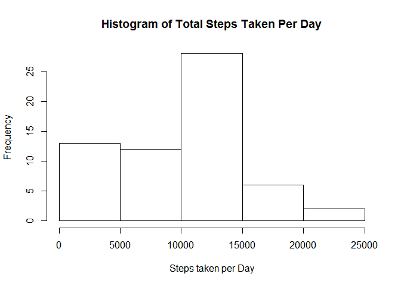
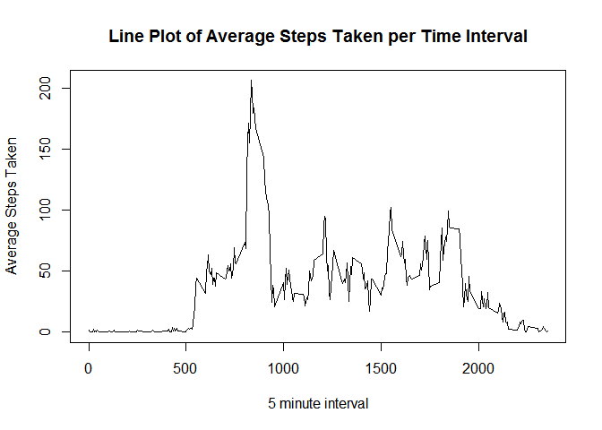
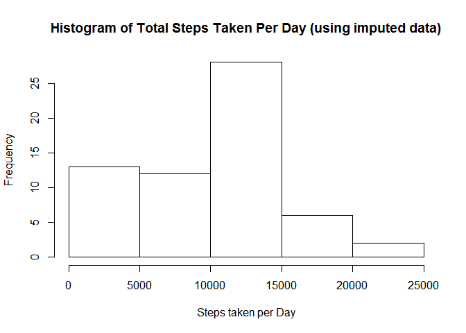
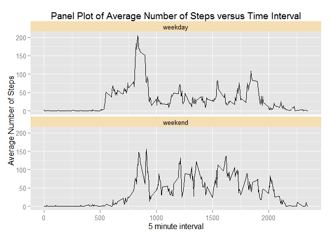

# Reproducible Research: Peer Assessment 1


## Loading and preprocessing the data
### First we load the data provided for our class.

```r
library(lubridate)
library(dplyr, warn.conflicts=FALSE)
library(timeDate)
library(ggplot2)

# load the zipped captured activity data into a data frame
activityDF <- read.csv(unz("activity.zip", "activity.csv"))

# check the activity data frame structure
str(activityDF)
```

```
## 'data.frame':	17568 obs. of  3 variables:
##  $ steps   : int  NA NA NA NA NA NA NA NA NA NA ...
##  $ date    : Factor w/ 61 levels "2012-10-01","2012-10-02",..: 1 1 1 1 1 1 1 1 1 1 ...
##  $ interval: int  0 5 10 15 20 25 30 35 40 45 ...
```

### I have chosen to preprocess the data by adding another field for a POSIXct vector

```r
# convert character encoded dates into new POSIXct formated date time objects
activityDF$DateTime <- with(activityDF, 
                            ymd_hms(paste(date, 
                                          sprintf("%06d", interval * 100), 
                                          sep=" ")))
```

## What is mean total number of steps taken per day?
For this part of the project, we ignore the missing data.

### First, need to average the steps taken per day.

```r
# first we need to sum the steps taken each day
dailyActivityDF <- activityDF %>% 
                        group_by(date) %>% 
                        summarize(TotalDailySteps=sum(steps, na.rm=TRUE))
```
### Second, generate a Histogram of averages steps taken per day

```r
# generate a histogram
hist(dailyActivityDF$TotalDailySteps, xlab="Steps taken per Day", 
     main="Histogram of Total Steps Taken Per Day")
```

 

### What are the statistics for total number of steps per day?

```r
# now check the central tendency statistics
mean(dailyActivityDF$TotalDailySteps)
```

```
## [1] 9354
```

```r
median(dailyActivityDF$TotalDailySteps)
```

```
## [1] 10395
```

The mean of the total number of 
steps taken per day = 9354.2295


The median of the total number of 
steps taken per day = 10395

## What is the average daily activity pattern?

```r
# first find the average steps per interval across all days
intervalActivityDF <- activityDF %>% 
                        group_by(interval) %>% 
                        summarize(MeanSteps=mean(steps, na.rm=TRUE))
# now plot using base graphics and a line plot
with(intervalActivityDF, plot(interval, MeanSteps, type='l', 
            xlab="5 minute interval", 
            ylab="Average Steps Taken", 
            main="Line Plot of Average Steps Taken per Time Interval"))
```

 

## Which 5-minute time interval has the max average daily steps?

```r
intervalActivityDF[which.max(intervalActivityDF$MeanSteps), ]
```

```
## Source: local data frame [1 x 2]
## 
##   interval MeanSteps
## 1      835     206.2
```

The 5-minute interval which on the average has the most steps is the
835
interval and it has on the average 
206.1698 
steps!

## Imputing missing values
### How many missing rows are there?

```r
# count the rows with NA
sum(is.na(activityDF$steps))
```

```
## [1] 2304
```
There are 2304 missing values.

### Method of Imputation
I have chosen to use the median value of the intervals as the replacement value for the missing values.

```r
# impute using the interval medians
imputedDF <- activityDF %>% 
    group_by(interval) %>% 
    mutate(steps=replace(steps, is.na(steps), median(steps, na.rm=TRUE)))
```


```r
# first sum the steps taken each day
dailyImputedDF <- imputedDF %>% 
                        group_by(date) %>% 
                        summarize(TotalDailySteps=sum(steps, na.rm=TRUE))
# generate the histogram
hist(dailyImputedDF$TotalDailySteps, xlab="Steps taken per Day", 
     main="Histogram of Total Steps Taken Per Day (using imputed data)")
```

 

### What are the statistics for total number of steps per day on the imputed data?

```r
# get the mean and median
mean(dailyImputedDF$TotalDailySteps)
```

```
## [1] 9504
```

```r
median(dailyImputedDF$TotalDailySteps)
```

```
## [1] 10395
```

The mean of the total number of 
steps taken per day = 9503.8689


The median of the total number of 
steps taken per day = 10395

### Do these values differ from estimates from the first part of the assignment?

The measures of central tendency of the imputed data set seems to be pretty much the same as without the imputed data.

### What is the impact of imputing missing data on the estimates of the total daily number of steps?

There is minimal impact of imputing missing data on the estimates of the total daily number of steps.

## Are there differences in activity patterns between weekdays and weekends?
### First mark the rows of the imputed dataset with which "Part Of Week"

```r
# now mark the weekends and weekdays in the dataframe
imputedDF[which(isWeekend(imputedDF$DateTime)), 'PartOfWeek'] <- 'weekend'
imputedDF[which(isWeekday(imputedDF$DateTime)), 'PartOfWeek'] <- 'weekday'
#imputedDF$PartOfWeek <- as.factor(imputedDF$PartOfWeek)
```
### Average the steps per interval by Part Of Week

```r
averagedDF <- imputedDF %>%
    group_by(PartOfWeek, interval) %>%
    mutate(avgSteps=mean(steps))
```

### Now plot the data

```r
ggplot(averagedDF, aes(interval, avgSteps)) +
    geom_line() + facet_wrap( ~ PartOfWeek, ncol=1) +
    theme(strip.background = element_rect(fill="wheat")) +
    ylab("Average Number of Steps") +
    xlab("5 minute interval") +
    ggtitle("Panel Plot of Average Number of Steps versus Time Interval")
```

 

## Conclusion
After looking at the panel plots, it appears there is a definite difference between the time intervals that steps are taken during the week when compared to the weekend.
